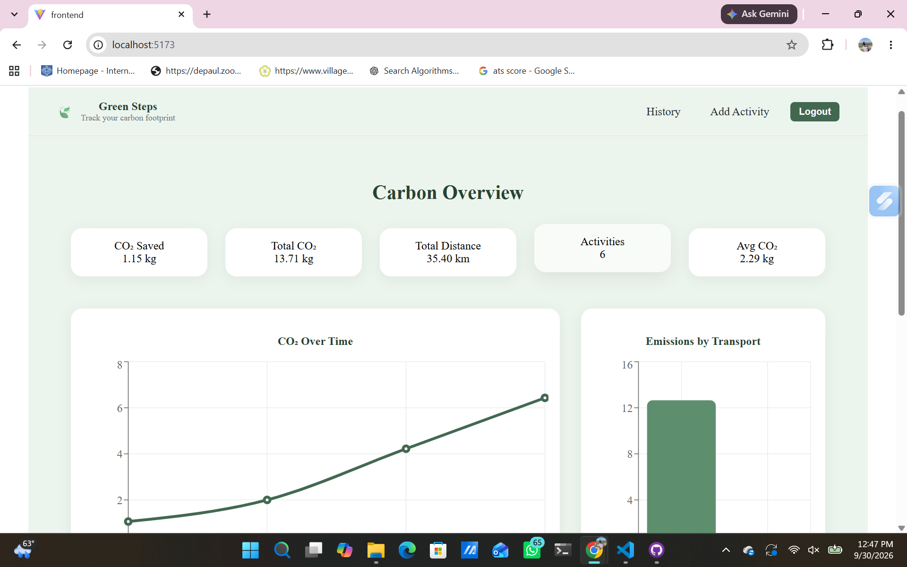
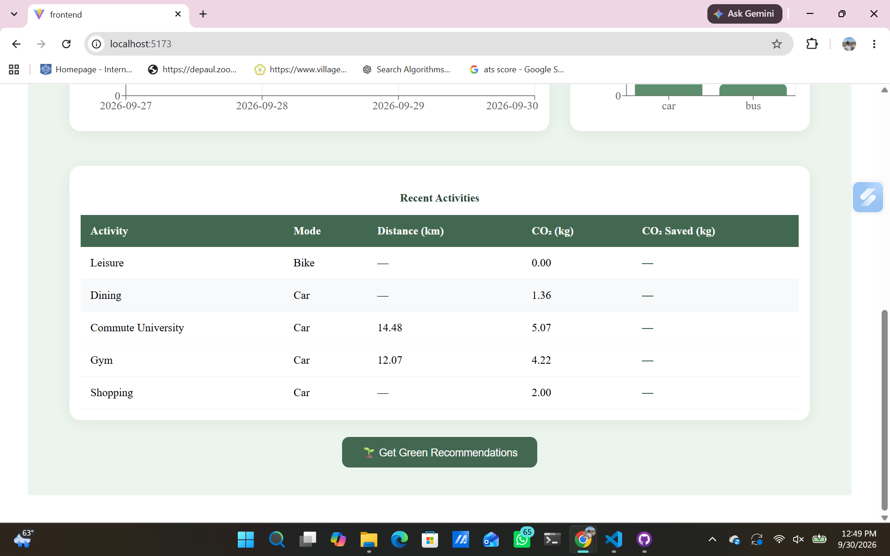
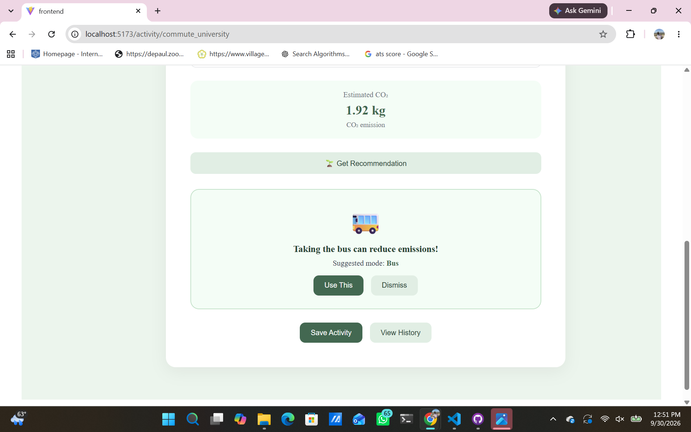
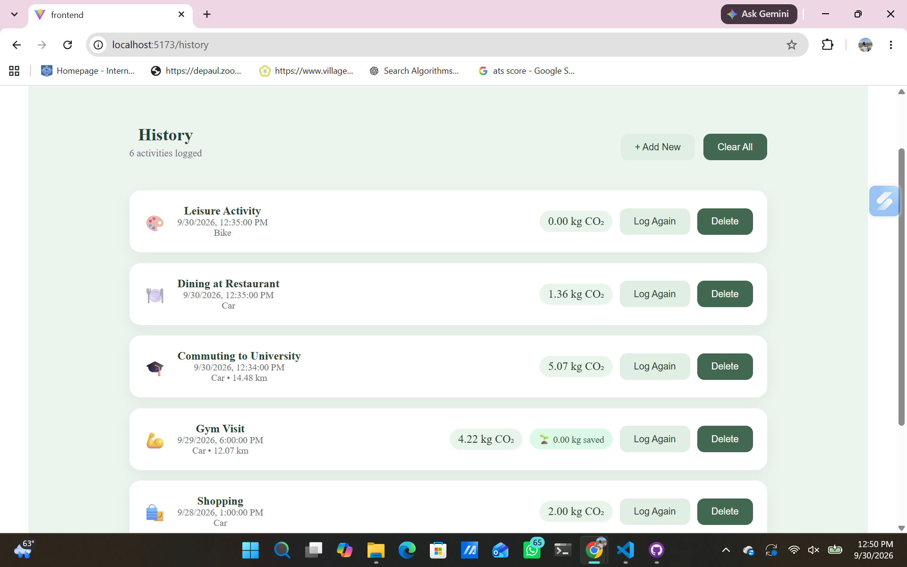

# 🌱 Green Steps

Green Steps is a full-stack carbon footprint tracking application that helps users understand the environmental impact of their everyday activities and discover more sustainable alternatives.

Users can log activities such as commuting, dining, shopping, gym visits, and leisure activities. Green Steps calculates estimated CO₂ emissions, tracks activity history, displays carbon-footprint analytics, and provides recommendations for reducing emissions.

## 📸 Application Preview

### Carbon Footprint Dashboard

The dashboard provides an overview of the user's carbon footprint, including total CO₂ emissions, CO₂ saved, distance traveled, activity statistics, and emissions visualizations.



### Add Activities

Users can select from several common activity types and log their daily activities.


### Activity Tracking

Green Steps tracks logged activities and displays carbon-emission information through the dashboard.



### Sustainable Recommendations

The application can recommend lower-emission transportation alternatives based on the activity being logged.



### Activity History

Users can review previously logged activities, view their estimated CO₂ emissions, log activities again, and delete entries.



## ✨ Key Features

- Carbon footprint calculation for everyday activities
- Activity-based CO₂ tracking
- Sustainable transportation recommendations
- Carbon savings tracking
- Interactive carbon-footprint dashboard
- CO₂ trends and transportation analytics
- Activity history
- Log-again functionality
- Delete activity functionality
- Multiple activity categories
- Full-stack frontend/backend integration

## 🛠️ Tech Stack

### Frontend
- React
- Vite
- JavaScript
- HTML/CSS

### Backend
- Java
- Spring Boot
- Spring Data JPA
- REST APIs
- Gradle

### Database
- H2 Database

### Development Tools
- Git
- GitHub
- Visual Studio Code

## 🏗️ Project Structure

```text
greensteps-chicago/
├── backend/                 # Spring Boot backend
├── frontend/                # React + Vite frontend
├── database/                # Database-related resources
├── docs/
│   └── screenshots/         # Application screenshots
├── scripts/                 # Project scripts
├── README.md
└── .gitignore